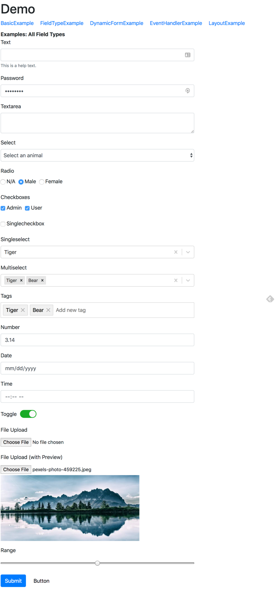

# ui-form-field

[](https://travis-ci.org/ngduc/ui-form-field)

A simple way to work with Forms in React.

- Live Demo: [Codesandbox](https://codesandbox.io/s/on50k50wy)
- Code examples: [Link](/src/examples)

### 🌟 Features

- Render different `form layouts`: Bootstrap 4, Semantic UI, Spectre and more. (including horizontal layout, inline fields)
- Compatible with `formik`. This is built on top of formik and can be used together with it (for custom fields, etc.)
- Support popular and advanced field types: react-select, multi-select, tag input with auto-complete, etc.
- Works well on mobile screens.

```JS
$ npm install ui-form-field
import { FormContainer, Form, Field, Button } from 'ui-form-field';

<FormContainer onSubmit={this.onSubmit} render={props => (
  <Form use="bootstrap4">
    <Field label="Text" name="text" />
    <Field name="password" />
    <Field textarea name="textarea" />
    <Field select options={animals} name="select" />
    <Field radios options={genders} name="radio" />
    <Field checkboxes options={roles} name="checkboxes" />
    <Field checkbox name="singleCheckbox" />
    <Field singleSelect options={animals} name="singleSelect" />
    <Field multiSelect options={animals} name="multiSelect" />
    <Field tagSelect name="tags" options={tags} />
    <Field number name="number" />
    <Field date name="date" />
    <Field time name="time" />
    <Field toggle inline name="toggle" />
    <Field file label="File Upload" name="file1" />
    <Field file withPreview label="File Upload (with Preview)" name="file2" />
    <Field range name="range" />

    <Button type="submit"/>
    <Button>Cancel</Button>
  </Form>
)} />
```

RESULT: (Full form, validation (with yup) & error messages)

[](https://codesandbox.io/s/on50k50wy)

### 📖 Documentation

[Change Log](/CHANGELOG.md)

#### TODO:
- Support more form layouts: Material, etc.
- More field types: Date Range, etc.
- (File a PR to request any feature, field type, etc.)

### 🙌 Thanks

All contributions are welcome!

[formik](https://github.com/jaredpalmer/formik)